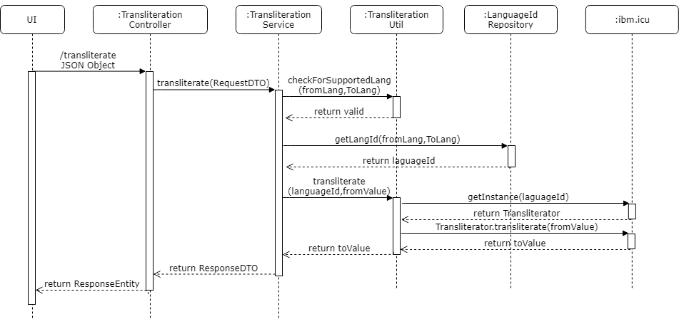

# Multi-Language Feature.

**Background**
- Mosip Support multi-language feature.

**Solution**
1. Id object mapping would be changed to support translation.
2. User could select primary language at first time log in.
3. From second time onward it would be the same language.
4. All error messages and information messages would be shown in primary language.
5. Secondary language would be one time and could not be changed.
6. Primary and secondary language would be persisted in DB
7. Multiple language translation file would be generated at design time.
8. Run time new languages could not be added.

**Transliteration**

- We would use virtual keyboard provided by angular to capture user preferred language input.

- We are Exposing the REST API to transliterate based on language code and value.

- Create the REST API to transliterate the value based on language, which internally call the ICU4j library.

- Internally call an ICU4j API to generate transliterated value, If it transliterated successfully send the response otherwise throw an respective exception.

**Sequence Diagram**

**Error Code** 

  Code   |       Type  | Message
-----|----------|-------------
PRG-TRA-001 |  Error   |  Failed to transliterate

**Dependency Modules**

Component Name | Module Name | Description | 
-----|----------|-------------|
ICU4j | Library | To transliterate.
Exception Manager  |  Kernel     |       To prepare the user defined exception and render to the user.
Log        |          Kernel         |   To log the process.
